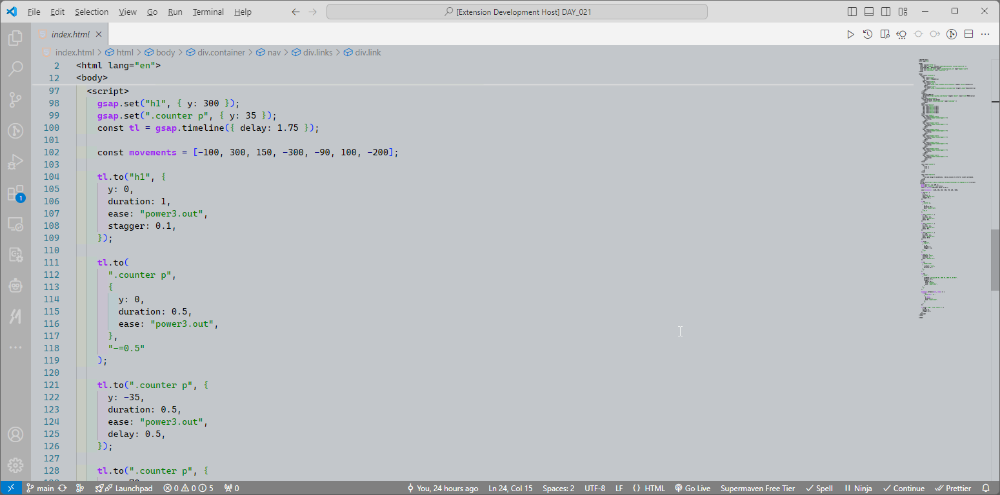
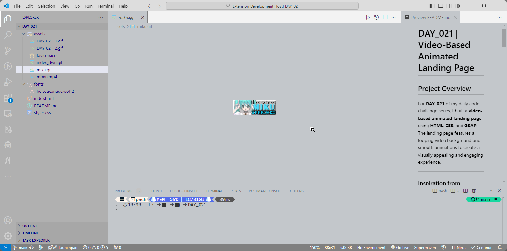
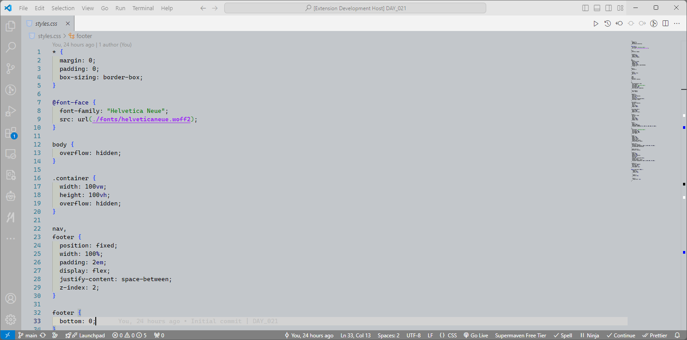
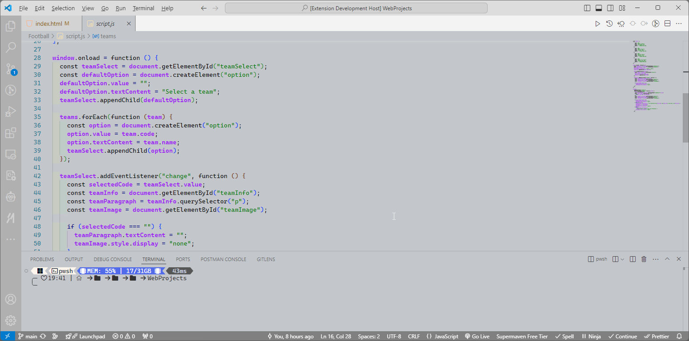
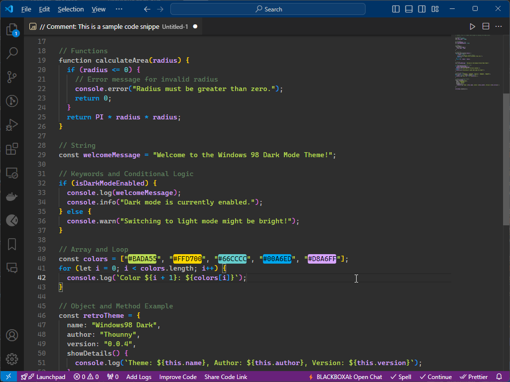
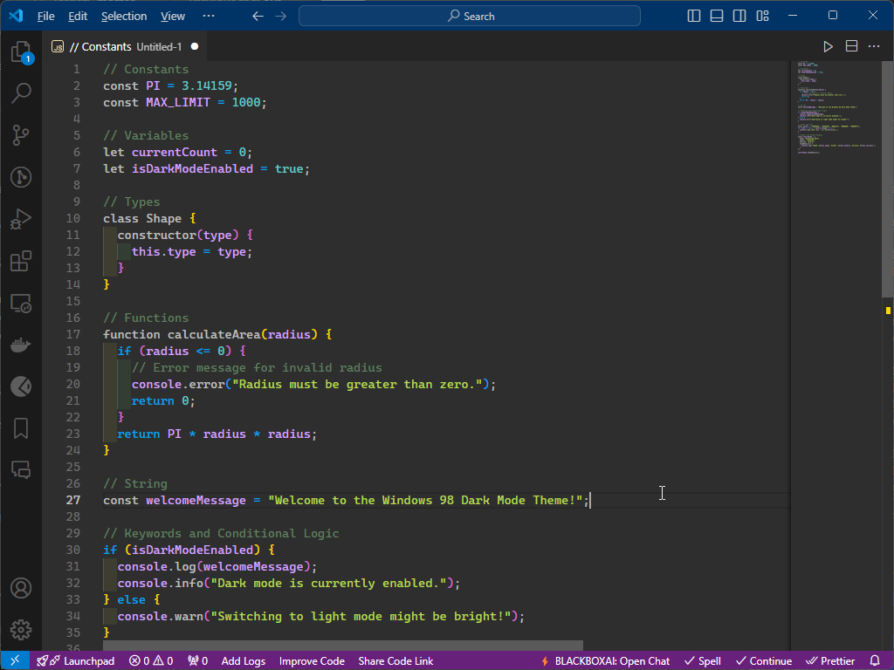

# Windows 98 Theme for Visual Studio Code

A nostalgic Visual Studio Code theme inspired by the classic Windows 98 UI. Bring back the retro look and feel of the 90s to your coding environment, with grey backgrounds, blue accents, and vintage syntax highlighting.

  

## Features

- **Retro Look**: Light grey backgrounds, dark borders, and classic blue accents reminiscent of the Windows 98 era.
- **Custom Syntax Highlighting**: Carefully chosen colors for keywords, strings, variables, and comments to match the vintage aesthetic.
- **Consistent UI**: Theme applies to all areas of VS Code including the sidebar, activity bar, and status bar.
- **Dark Mode**: A new dark mode variant for a retro-inspired night-time coding experience.

## Installation

1. Open Visual Studio Code.
2. Go to the **Extensions** view by clicking on the Extensions icon in the Activity Bar on the side of the window or by pressing `Ctrl+Shift+X`.
3. Search for `Windows 98 Theme`.
4. Click **Install** to install the theme.
5. Once installed, go to **File > Preferences > Color Theme** and select **Windows 98 Theme** from the list.

## Preview

To preview the theme before installation, you can:
- Clone this repository.
- Open the folder in VS Code.
- Press `F5` to run the theme in development mode and try it out in a new window.

## Screenshots

### Light Mode Previews

### Dark Mode Previews

## Customization

Feel free to fork this repository and modify the theme to suit your own style. You can edit the `theme.json` file in the `themes` folder to adjust the colors of various elements.

## Contributing

If you notice any bugs or have suggestions for improving the theme, feel free to open an issue or submit a pull request.

## License

This theme is licensed under the [MIT License](./LICENSE).

---

## Author

**Thounny Keo**  
Creative Developer | Designer  
Frontend Development Student | Year Up United

---

---